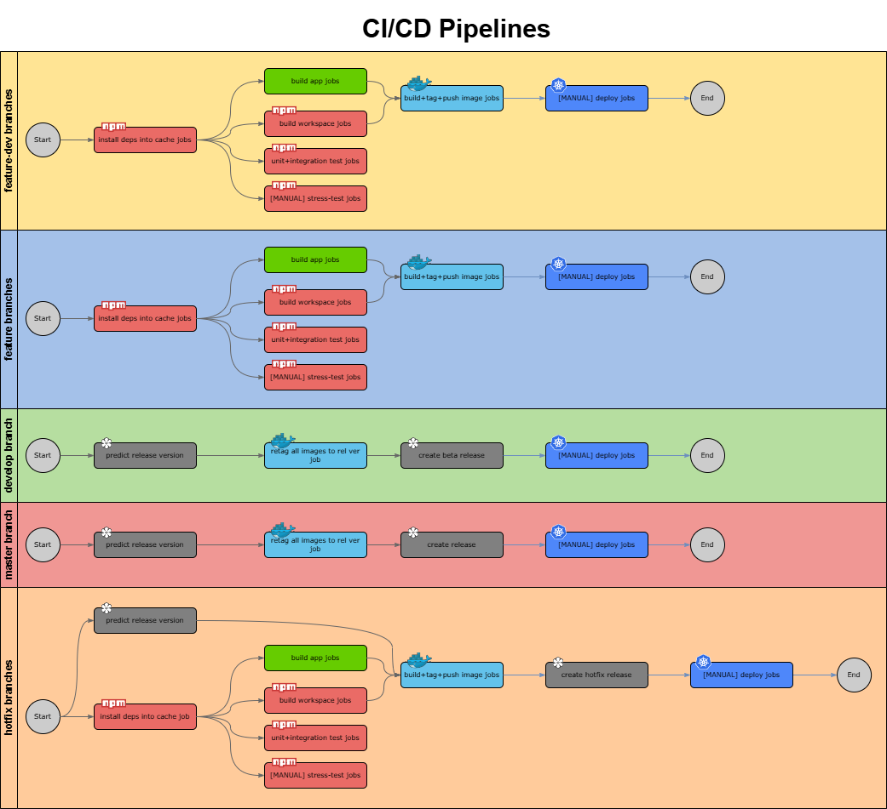
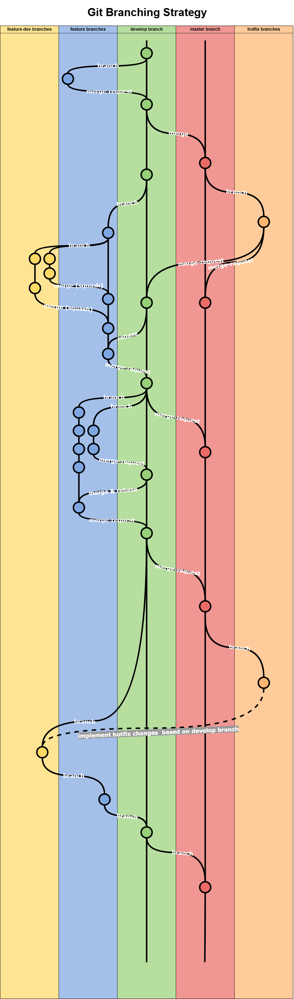

# CI/CD Cheat Sheet


# Git Tools

For efficient and guided creation of branches and commits in the terminal, please download the following tool:
- https://github.com/T-vK/git-tools/tree/master


<br><br>
________
________
<br><br>


# Pipelines


<details><summary>Click to expand..</summary>


  
</details>


<br><br>
________
________
<br><br>


# Workflows

## Rebases

### Develop -> Feature-dev Branch

<details><summary>Click to expand..</summary>

- Man **MUSS** auf jeden Fall hier kein Rebase vom Developbranch durchführen, weil wenn man auf seinem Feature-Devbranch hunderte von Comets hat, dann **MUSS** jeder einzelne Comet, den man hat, rebased werden mit dem Developbranch.


## 🔹 Dein Problem

* Dein Feature-Branch hat viele Commits (156).
* Develop hat zwischenzeitlich 21 Commits bekommen.
* Rebase auf Develop → Git will **alle 156 Commits einzeln auf die neue Basis spielen** → dauert ewig, viele Konflikte.
* Dein Ziel: Datei gelöscht behalten, PR sauber machen, später Squash-Merge.

---

## 🔹 Deine Alternativen

### 1️⃣ Rebase wie bisher

* **Vorteil:** Commit-Historie bleibt linear.
* **Nachteil:** Lange, mühsam, viele Konflikte bei langen Branches.
* **Fazit:** Sinnvoll, wenn du saubere Linearität willst, aber bei 156 Commits auf 21 neue sehr zäh.

---

### 2️⃣ Merge Develop in Feature-dev-Branch

```bash
git checkout feat/PRIV-001/add-new-button/dde
git merge develop
```
- `develop` ist incoming und `feat/PRIV-001/add-new-button/dde` is current

* Git erstellt **einen Merge-Commit** statt jeden Commit neu zu spielen.
* Konflikte müssen trotzdem gelöst werden, **aber nur einmal pro Datei**, nicht für jeden Commit.
* Danach: Pushen, Squash-Merge auf Feature-Branch → PR → Develop: nur **ein Commit**.

**Wichtig:**

* Für den PR später ist es egal, ob du vorher einen Merge statt Rebase gemacht hast, **weil du sowieso einen Squash-Merge machst**.
* Die Merge-Historie auf deinem Feature-Branch spielt keine Rolle, **der PR wird sauber auf einen Commit reduziert**.


## 🔹 Schritt 1: Konflikte lösen

1. Öffne alle Dateien mit Konflikten.
2. Entscheide, welche Änderungen übernommen werden (Feature oder Develop oder Mix).
3. Entferne die Git-Marker (`<<<<<<<`, `=======`, `>>>>>>>`).

---

## 🔹 Schritt 2: Änderungen stagen (**MUSS**)

```bash
git add .
```

* Das markiert alle Konflikte als **gelöst**.
* Ohne `git add` weiß Git nicht, dass du die Konflikte gelöst hast.

---

## 🔹 Schritt 3: Merge abschließen (**MUSS**)

```bash
git commit

# cursor if there are problems
# git -c core.editor=notepad commit
```

* Git öffnet standardmäßig den Merge-Commit-Editor.
* Du kannst die vorgeschlagene Nachricht übernehmen, z. B. `Merge branch 'develop' into feat/...`.
* Das erzeugt **einen Merge-Commit**, der alle Änderungen von Develop integriert.

---

## 🔹 Optional / empfohlen

* Prüfe, dass alles kompiliert / getestet ist:

```bash
npm ci
npm test   # oder test:all
```

* Dann kannst du deinen Feature-Branch pushen:

```bash
git push --set-upstream origin feat/PRIV-001/add-new-button/main
```

* **Squash-Merge später auf PR:**

  * Dein Feature-Branch enthält jetzt Merge-Commit + deine Änderungen.
  * Wenn du PR machst, wähle **Squash-Merge**, dann wird die gesamte Historie auf **einen Commit** reduziert → sauber in Develop.


</details>


<br><br>

--- 

<br><br>


## Ticket > Merge Request (MR) Prozess

<details><summary>Click to expand..</summary>

## 1. Ticket in Jira setzen 📝
- Setze das Ticket auf **`In Progress`** in Jira.
- Verschiebe das Ticket in den aktuellen Sprint.

---

## 2. Feature- und Feature-Dev-Branch erstellen 🛠️
Erstelle einen neuen Feature-Branch und einen zugehörigen Feature-Dev-Branch basierend auf dem `develop`-Branch.

```shell
# Der Befehl mkbranch fragt auch automatisch, ob der aktuelle develop-Branch geladen werden soll
git checkout develop
git pull

# Feature Branch erstellen
# git branch feat/PRIV-001/add-new-button/main
# git checkout feat/PRIV-001/add-new-button/main
mkbranch

# Feature-dev Branch erstellen
# git branch feat/PRIV-001/add-new-button/dde
# git checkout feat/PRIV-001/add-new-button/dde
mkbranch
```

---

## 3. Lokale Umgebung aktualisieren 🌐
Wenn du eine lokale Umgebung wie **Minikube** verwendest, stelle sicher, dass deine Deployments oder Dienste auf dem neuesten Stand sind.

---

## 4. Abhängigkeiten aktualisieren 📦
Falls nötig, aktualisiere die Abhängigkeiten:

```shell
npm ci
```

---

## 5. Ticket lösen und Commit auf Feature-Dev-Branch pushen 🚀
- Stelle sicher, dass alle Tests erfolgreich sind. ✔️
- Hast du alle `.only`-Tests entfernt? 🧹
- Wurden alle ticketbezogenen Änderungen durchgeführt? (z. B. Migrationsskripte) 🔄

---

## 6. Feature-Dev-Branch auf Feature-Branch squashen 🔨
Führe einen **Squash-Merge** des Feature-Dev-Branches in den Feature-Branch durch.

```shell
git checkout feat/PRIV-001/add-new-button/main
git merge --squash feat/PRIV-001/add-new-button/dde

# Wenn Breaking Changes vorhanden sind, nutze eine spezielle Commit-Nachricht!
# git commit -m "fix(ABC-232): Edit custom block"
# git push

mkcommit
```

**Falls Breaking Changes vorliegen, füge einen Footer zur Commit-Nachricht hinzu:**

```shell
git commit -m 'fix(ABC-232): Edit custom block' -m 'BREAKING CHANGE: Route xyz wurde zu abc umbenannt'

# Falls du versehentlich bereits ohne Breaking Change committed hast, kannst du dies nachträglich ändern:
# git add . && git commit --amend -m 'refactor(ABC-2139): MongoDB von Version 5 auf 7 aktualisiert' -m 'BREAKING CHANGE: MongoDB von Version 5 auf 7 aktualisiert'
```

Stelle sicher, dass nur ein Commit im Feature-Branch vorhanden ist. Falls du Änderungen vergessen hast, kannst du dies nachträglich tun:

<details><summary>Click to expand..</summary>

```shell
git add . && git commit --amend --reuse-message HEAD && git push -f
```

</details>


<br><br>


Falls du mehrere Commits im Feature-Branch hast, kannst du sie zurücksetzen:

<details><summary>Click to expand..</summary>

```shell
# Überprüfe mit git log, wie viele der letzten Commits zusammengeführt werden müssen. Alternativ kannst du dies auch im Merge Request (MR) sehen.

# Wechsel zum Ziel-Branch
git checkout your_branch

# Setze die letzten e.g. 4 Commits lokal zurück
# Alternativ kannst du dies auch einzeln mit git reset --soft HEAD^ tun, was sicherer ist.
git reset --soft HEAD~4

# Stelle sicher, dass die betroffenen Commits nicht mehr im Verlauf erscheinen:
git log

# Überprüfe, ob die Dateien der vorherigen Commits immer noch vorhanden sind
git status

git add . && git commit --amend --reuse-message HEAD && git push -f
```

Es gibt Ausnahmen. Zum Beispiel, wenn du an einem Ticket mit Sub-Tasks arbeitest, kannst du mehrere Commits für verschiedene Ticket-IDs erstellen:

- **Branching-Strategie:** Feature-Branches
- **Wichtig:** Falls dein MR aufgrund eines Problems im ersten Commit abgelehnt wird, musst du die Dateien erneut stagen und die Commits neu erstellen.

```shell
# Wenn du bereits committed hast, kannst du es später anpassen:
git add . && git commit --amend -m 'refactor(CCS-2139): MongoDB von Version 5 auf 7 aktualisiert' -m 'BREAKING CHANGE: MongoDB von Version 5 auf 7 aktualisiert'

# Stelle sicher, dass du folgende Schritte machst:
git add . && git commit --amend --reuse-message HEAD && git push -f

# Nutze git log, um zu überprüfen, wie viele der letzten Commits zusammengeführt werden müssen.

# Wechsel zum Ziel-Branch
git checkout your_branch

# Setze z.B. die letzten 4 Commits lokal zurück
git reset --soft HEAD~4

# Überprüfe, ob die betroffenen Commits nicht mehr im Verlauf erscheinen:
git log

# Stelle sicher, dass die Dateien der vorherigen Commits noch vorhanden sind
git status

# Stage die Dateien für den 1. Commit:
git add README.md

# Überprüfe, ob die gewünschten Dateien gestaged sind:
git status

# Force-Push, um die Commit-Historie auf GitLab mit den lokalen Änderungen zu überschreiben
git push -f

# Wiederhole den Prozess, wenn du einen zweiten Commit hast.
```

</details>


---

## 7. `develop`-Branch auf den Feature-Branch rebasen 🔄
Führe einen **Rebase** des `develop`-Branches auf den Feature-Branch durch.

```shell
git checkout develop
git pull

git checkout feat/PRIV-001/add-new-button/main
git rebase develop

# ----- Konflikte lösen ----
# Wenn es Merge-Konflikte gibt und du diese löst, benutze:

# Bei Konflikten mit der package-lock.json:
# rm -f package-lock.json
# npm i

# git add .
# git rebase --continue


### If you get this error when try to git rebase --continue
### hint: Waiting for your editor to close the file... C:\Users\denni\AppData\Local\Programs\cursor\Cursor.exe: line 1: C:UsersdenniAppDataLocalProgramscursorCursor.exe: command not found
### error: there was a problem with the editor 'C:\Users\denni\AppData\Local\Programs\cursor\Cursor.exe'
### Please supply the message using either -m or -F option.

### Option 1 - Use different terminal window

### Option 2 - To get unblocked immediately and continue your rebase, you can tell Git to use a different editor (like Notepad) for this specific operation. In your PowerShell terminal, run:
### ```
### git -c core.editor=notepad rebase --continue
### ```


# --------------------------

# Wenn nach dem Wechseln der Branches untracked Files übrig bleiben:
git clean -f -d -x -i -e node_modules

# Stelle sicher, dass die Unit-Tests und Integrationstests lokal wieder erfolgreich sind.
```

Führe diesen Befehl immer aus! Falls es Änderungen an NPM-Paketen gibt, die auf eine höhere Version aktualisiert wurden, kannst du die aktuelle Version mit folgendem Befehl installieren:

```shell
npm ci
```

---

## 8. Feature-Branch pushen ⬆️
Push deinen Feature-Branch:

```shell
git push --set-upstream origin fix/ABC-232/edit-custom-block/main

# git push --force --set-upstream origin fix/ABC-232/edit-custom-block/main
# --force ist nur nötig, wenn der Branch vor dem Rebase bereits gepusht wurde.
# Beim Rebase wird die Commit-Historie immer überschrieben,
# daher erfordert der nächste Push immer das --force-Flag.
```

---

## 9. Warten bis die GitLab-Pipeline abgeschlossen ist ⏳
Warte, bis die GitLab-Pipeline abgeschlossen ist.

---

## 10. Deployment und Ticketstatus 🚀
- Deploye auf den Test-Cluster und stelle sicher, dass alles funktioniert.
- Setze das Ticket auf **`FINISHED`**, wenn alles erfolgreich ist.

---

## 11. Merge Request (MR) erstellen ➡️
Erstelle den Merge Request im GitLab:  
**Feature-Branch** → **Develop-Branch**


<br><br>


### Änderungen auf dem develop Branch seit Erstellung des PR

<details><summary>Click to expand..</summary>

```shell
git checkout develop
git pull

git checkout feat/PRIV-10/create-evident-abb-v2/main
git rebase develop

# ----- Konflikte lösen ----
# Wenn es Merge-Konflikte gibt und du diese löst, benutze:

# Bei Konflikten mit der package-lock.json:
# rm -f package-lock.json
# npm i

# git add .
# git rebase --continue


### If you get this error when try to git rebase --continue
### hint: Waiting for your editor to close the file... C:\Users\denni\AppData\Local\Programs\cursor\Cursor.exe: line 1: C:UsersdenniAppDataLocalProgramscursorCursor.exe: command not found
### error: there was a problem with the editor 'C:\Users\denni\AppData\Local\Programs\cursor\Cursor.exe'
### Please supply the message using either -m or -F option.

### Option 1 - Use different terminal window

### Option 2 - To get unblocked immediately and continue your rebase, you can tell Git to use a different editor (like Notepad) for this specific operation. In your PowerShell terminal, run:
### ```
### git -c core.editor=notepad rebase --continue
### ```


# --------------------------

# Wenn nach dem Wechseln der Branches untracked Files übrig bleiben:
git clean -f -d -x -i -e node_modules

# Stelle sicher, dass die Unit-Tests und Integrationstests lokal wieder erfolgreich sind.
```

Dann force push:
```
git push --force
```
  
</details>


<br><br>


### 🔄 PR-Workflow mit gesquashten Review-Fixes
- Dieser Guide beschreibt den Workflow, wie du nach einem Review gezielt Änderungen in einem sauberen Commit auf deinen bestehenden **Pull Request Feature Branch** bringst – ohne die Commit-History zu vermüllen und ohne eure Squash-Konvention zu brechen.

<details><summary>Click to expand..</summary>


## 🧠 Ziel
- **Review-Fixes** iterativ auf eigenem Branch durchführen.
- Alle Fixes **squashen zu einem sauberen Commit**.
- Den Commit als **zweiten Commit** auf den ursprünglichen PR-Branch bringen.
- Kein Force-Push notwendig. PR bleibt offen und sauber.

---

## 🔧 Ausgangssituation

| Branch                                  | Zweck                        |
|----------------------------------------|------------------------------|
| `feat/PRIV-10/create-evident-abb-v2/main`         | Ursprünglicher PR-Branch     |
| `feat/PRIV-10/create-evident-abb-v2-pr-changes/dde` | Neuer Dev-Branch für Fixes   |

---

## ✅ Step-by-Step Guide

### 1. Wechsle auf deinen Review-Fix-Branch
```bash
git checkout feat/PRIV-10/create-evident-abb-v2-pr-changes/dde
```

### 2. Squashe alle Commits zu einem einzelnen Fix-Commit
```bash
git reset --soft origin/feat/PRIV-10/create-evident-abb-v2/main
git commit -m "fix(PRIV-10): Review-Fixes & Ergänzungen nach Feedback"
```

> 🧠 **Erklärung:**  
> Du befindest dich hier **auf dem Fix-Branch**, der 10–20 Commits enthalten kann.  
> `git reset --soft` setzt deinen HEAD auf den Stand des PR-Branches – aber **behält alle Änderungen gestaged**.  
> Dann erzeugst du **einen neuen, einzigen Commit**, der alle Fixes zusammenfasst.  
> Ergebnis: ein sauberer, gesquashter Fix-Commit auf dem Fix-Branch.

### 3. Wechsle zurück auf den PR-Branch
```bash
git checkout feat/PRIV-10/create-evident-abb-v2/main
```

### 4. Mergest den neuen Commit rein – ohne Squash oder Fast-Forward
```bash
git merge --no-ff feat/PRIV-10/create-evident-abb-v2-pr-changes/dde -m "chore(PRIV-10): Merge Review-Fixes from dde branch"
```

> 🔍 Alternativ: Wenn du den Commit einfach nur übernehmen willst:
> ```bash
> git cherry-pick feat/PRIV-10/create-evident-abb-v2-pr-changes/dde
> ```

### 5. Push zurück zum Remote-PR-Branch
```bash
git push origin feat/PRIV-10/create-evident-abb-v2/main
```

---

## 🧼 Ergebnis

- Dein ursprünglicher PR-Branch enthält:
  1. ✅ Den ersten Commit aus der ursprünglichen Arbeit
  2. 🧼 Einen sauberen Fix-Commit mit allen Änderungen aus dem Review

- Die Review-Historie bleibt nachvollziehbar.
- Kein Force-Push nötig.
- Git-Log bleibt klar und durchdacht.
- Reviewer sieht: Was war, was wurde gefixt.

  
</details>


---

## 12. Postman-Collection aktualisieren 📬
Falls nötig, aktualisiere die Postman-Collection.


</details>


<br><br>
<br><br>


## 📝 Hotfix Workflow (Feature/Dev-Logik)

<details><summary>Click to expand..</summary>


### 1️⃣ Hotfix-Feature-Branch erstellen

* Ausgangspunkt: **Master**

```bash
git checkout master
git pull origin master
git checkout -b hotfix/ABC-999/main
```

* **Zweck:** sauberer Commit-Container für den späteren Squash.
* Kein Arbeiten direkt hier, nur Branch als „Single-Commit-Ziel“ vorbereiten.

---

### 2️⃣ Hotfix-Dev-Branch erstellen

* Basis: **Hotfix-Feature-Branch**

```bash
git checkout hotfix/ABC-999/main
git checkout -b hotfix/ABC-999/dde
```

* **Zweck:** Spielwiese für mehrere Commits, Tests, Experimente.
* **Multiple Commits erlaubt** → lokale Iterationen, Refactoring, Tests.

---

### 3️⃣ Hotfix entwickeln

* Bearbeitung auf `hotfix/ABC-999/dde`
* Lokale Tests laufen lassen:

```bash
npm ci
npm test
```

* Mehrere Commits wie üblich:

```bash
git add .
git commit -m "fix(ABC-999): bugfix step 1"
git commit -m "fix(ABC-999): bugfix step 2"
```

---

### 4️⃣ Squash Merge in Hotfix-Feature-Branch

* Wechsel zum Feature-Branch:

```bash
git checkout hotfix/ABC-999/main
git merge --squash hotfix/ABC-999/dde
git commit -m "hotfix(ABC-999): critical bugfix payment processing"
```

* Ergebnis: **ein sauberer Commit** im Feature-Branch.

---

### 5️⃣ Merge Hotfix in Master

```bash
git checkout master
git merge --no-ff hotfix/ABC-999/main
git push origin master
```

* CI/CD baut den Hotfix und deployed in Produktion.

---

### 6️⃣ Merge Hotfix in Develop

* Develop up-to-date halten:

```bash
git checkout develop
git pull origin develop
git merge --no-ff hotfix/ABC-999/main
git push origin develop
```

* Konflikte lösen falls nötig
* Tests erneut ausführen.

---

### 7️⃣ Branch Cleanup (optional)

```bash
git branch -d hotfix/ABC-999/dde
git branch -d hotfix/ABC-999/main
git push origin --delete hotfix/ABC-999/dde
git push origin --delete hotfix/ABC-999/main
```

* Branches existieren nur temporär, um CI/CD und Historie sauber zu halten.

---

### ✅ Prinzipien

1. **Feature-Branch zuerst**, Dev-Branch danach → sauberer Squash möglich
2. **Multiple Commits nur im Dev-Branch** → Master bleibt sauber
3. **Master = stabile Basis**, Develop bekommt Hotfix **nach Master**
4. **CI/CD-Checks für Hotfix verpflichtend** → Qualitätssicherung


</details>


  
<br><br>
<br><br>
____
<br><br>
<br><br>

## Guided Branch and Commit Creation

<br><br>


### Commit Convention

<details><summary>Click to expand..</summary>

We follow the Angular Commit Convention. This convention ensures a consistent and traceable structure for our commit messages. More information can be found here: [Conventional Commits](https://www.conventionalcommits.org/).

Our `git-tools` already includes the implementation of this convention to ensure that all commits adhere to the standards.


</details>


### Branching Strategy and Deployment Process

<details><summary>Click to expand..</summary>

---

## Overview

This documentation describes the branching strategy and deployment process for our project. We use the `main`, `develop`, `Feature-Branches`, and `Feature-Dev-Branches`. This structure ensures that stable and tested code is deployed to production.





### Branches and Their Usage

#### 🛠 Hotfix Branches

Hotfix branches are similar to feature branches but are branched directly from the main branch. They are used for quick fixes of critical bugs and are immediately deployed to production.

**CI/CD:**
- Runs tests automatically
- Builds apps automatically
- Builds Docker images for hotfixes
- Tags Docker images with hotfix release versions
- Pushes Docker images to Nexus
- Pushes Docker images to Google Cloud
- Creates hotfix releases for each push
- Manual deployment task for Test Namespace and Production Namespace

**Rules:**
- Each hotfix branch must be formatted as `hotfix/{DESCRIPTION}`
- Full Regex: `/^hotfix/[\\w+-]*\\$/`
  
Example: `hotfix/critical-security-fix`

Once a hotfix is deployed and functioning:
- Changes must also be merged into the develop branch by creating a feature branch and submitting a pull request.

**Warning:** 
- If multiple hotfixes are deployed, the second hotfix branch must be branched from the first hotfix branch. Otherwise, deployment changes may be lost.

<br><br>
<br><br>

#### 🚀 Main Branch (Stable Releases)

The `main` branch is the production branch. All changes merged into the main branch should be deployed to production.

**Rules:**
- No direct pushes to this branch.
- Changes must come through pull requests from the develop or hotfix branch.
- No squashing; all commits from the develop branch must appear in the main branch.
- No additional commits (e.g., merge commits).

**Purpose:**  
The `main` branch represents the current state of production.

**Deployment:**  
After merging `develop` into `main`, the application is deployed to the staging environment. Once tests on staging are successful, the deployment proceeds to production.

**CI/CD:**
- Tags Docker images with commit hash on stable release version
- Pushes Docker images to Nexus
- Creates stable releases for each accepted merge request
- Manual deployment task for Test Namespace
- Manual or automated deployment task for Production Namespace

**Pre-merge Requirements:**
- All tests must be successfully executed (see below: Automated QA Checks and Manual QA Checks).


<br><br>
<br><br>

#### 🛠️ Develop Branch (Beta Releases)

The `develop` branch serves as the integration branch. All features that are ready to be merged but still need testing or validation are placed here.

**Rules:**
- No direct pushes to this branch.
- Changes must come through pull requests from feature branches.
- No squashing; all commits from the feature branch must appear in the develop branch.
- No additional commits (e.g., merge commits).

**Purpose:**  
The `develop` branch contains the latest stable developments that are not yet ready for production.

**Merge:**  
Feature branches are regularly merged into the develop branch. Once new features are implemented and tested, they are merged into `main`.

**CI/CD:**
- Unit tests: Test individual functions for correctness.
- Integration tests: Test the interaction between different modules.
- E2E tests: Simulate user interactions to ensure overall functionality.
- Static code analysis: Looks for bugs and security vulnerabilities.
- Tags Docker images with commit hash on beta release version.
- Pushes Docker images to Nexus
- Creates unstable/beta releases for each accepted merge request
- Manual deployment task for Test Namespace

**Manual QA Checks:**
- UI/UX Review: Ensures design consistency and usability.

<br><br>
<br><br>

#### 🌱 Feature Branches

Feature branches are used for developing new features or bug fixes. These branches are based on the `develop` branch.

**Rules:**
- Each feature branch must be formatted as `{TYPE}/{JIRA_TICKET_ID}/{DESCRIPTION}/main`.
- Types: feat|fix|ci|build|docs|style|refactor|perf|test
- Full Regex: `/^(feat|fix|ci|build|docs|style|refactor|perf|test)\\/[\\w+-]*\\/([\\w+-]*)\\/main$/`

Examples:
- `feat/CCS-1/new-feature-foo/main`
- `refactor/CCS-1/new-directory-structure/main`
- `fix/CCS-1/bugfix-ui-freezing/main`

Each feature branch represents a Jira ticket (and all of its sub-tasks).  
Each commit represents a Jira ticket (and all of its sub-tasks).

Each commit follows the Angular Commit Convention with the ticket ID as the scope:
```
feat(CCS-1112): Add new feature
```

**Merge:**  
Once a feature is fully developed, it is merged into `develop` via a pull request.

**CI/CD:**
- Unit tests: Ensure each function works correctly.
- Linting & code-style checks: Prevent styling issues and inconsistencies.
- Security scans: Check for vulnerabilities.
- Builds apps automatically.
- Builds Docker images for the apps.
- Tags Docker images with commit hash.
- Pushes Docker images to Nexus.
- Manual deployment task for Test Cluster.

<br><br>
<br><br>

#### 🔧 Feature-Dev Branches

Feature-dev branches are used for the internal, detailed development of a feature. They serve as "working branches" for developers, which are later used as the base for feature branches.

**Rules:**
- Each feature-dev branch must be formatted as `{TYPE}/{JIRA_TICKET_ID}/{DESCRIPTION}/{3_LETTER_DEV_NAME}`.
- Types: feat|fix|ci|build|docs|style|refactor|perf|test
- Full Regex: `/^(feat|fix|ci|build|docs|style|refactor|perf|test)\\/[\\w+-]*\\/([\\w+-]*)\\/\\w\\w\\w$/`

Examples:
- `feat/CCS-1/new-feature-foo/ofi`
- `refactor/CCS-1/new-directory-structure/dde`
- `fix/CCS-1/bugfix-ui-freezing/tvk`

Each feature-dev branch represents a Jira ticket (and all its sub-tasks).  
No commit convention required.

**Merge:**  
When development is complete, the feature-dev branch is squash merged into the corresponding feature branch.


---

## QA Checks and Testing

### 🛡️ Automated QA Checks

Automated QA checks ensure that code is stable and of high quality before reaching production.

- **Unit Tests:**  
  Test individual functions and classes for correctness.

- **Integration Tests:**  
  Check if different modules work together.

- **End-to-End (E2E) Tests:**  
  Simulate real user interactions to ensure the application functions as a whole.

- **Linting & Code-Style Checks:**  
  Ensure code consistency and readability.

- **Static Code Analysis:**  
  Finds potential bugs and security vulnerabilities.

- **Performance Checks:**  
  Test load times and resource usage.

- **Security Scans:**  
  Check for known vulnerabilities in dependencies.

### 🔍 Manual QA Checks

Manual QA checks are essential to ensure a high-quality user experience and to test the application for unexpected errors.

- **Feature Testing:**  
  Manually test new features to ensure they work as expected.

- **UI/UX Review:**  
  Ensure the application’s design is consistent and user-friendly.

- **Regression Testing:**  
  Ensure existing features work correctly after changes or additions.

- **Exploratory Testing:**  
  Test without predefined test cases to uncover unforeseen bugs and validate the application under various conditions.


</details>
